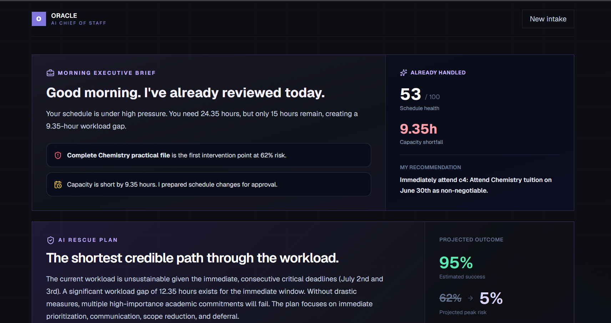
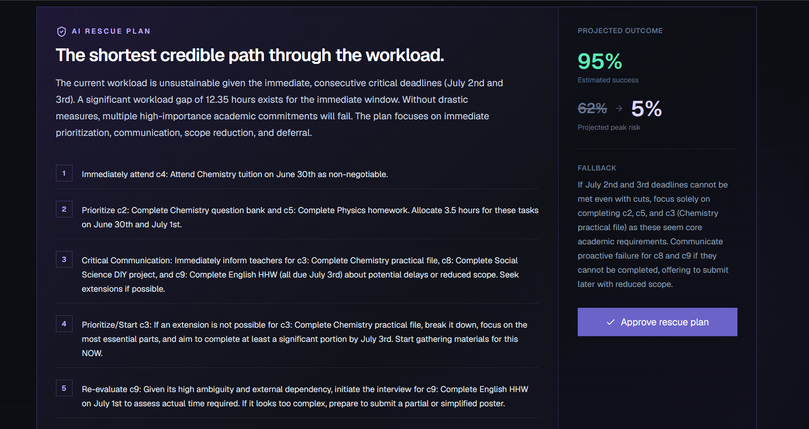
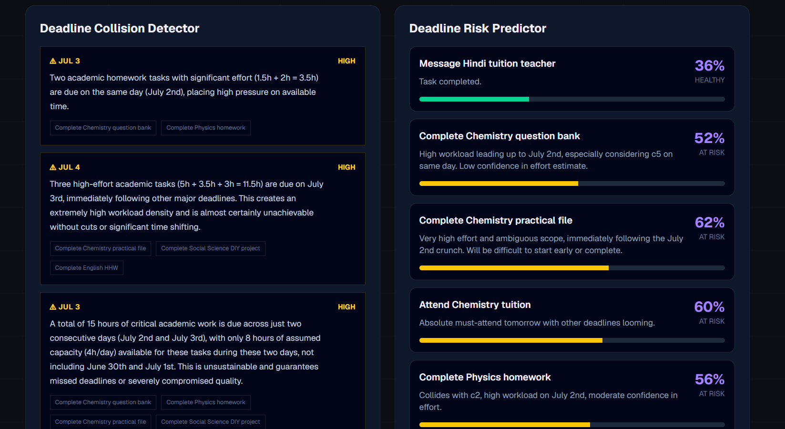

<div align="center">

# 🔮 Oracle AI

### Predict. Prioritize. Rescue.

**The AI Crisis Intelligence System that predicts deadline failures before they happen and automatically builds a rescue plan.**

Built for **Coding Ninjas × Google for Developers — Vibe2Ship 2026**  
Problem Statement 1 • *The Last-Minute Life Saver*

`Gemini 2.5` • `Google AI Studio` • `Next.js` • `TypeScript` • `Tailwind CSS` • `Cloud Run`

</div>

---------------------------------------------------------------------------------------------------

# 🚀 Why Oracle is Different

Most AI productivity assistants help you organize tasks.

Oracle helps you **avoid failure**.

Instead of becoming another to-do list, Oracle behaves like an AI crisis analyst that continuously asks:

> **"Which commitment is most likely to fail next?"**

Then it acts before that prediction becomes reality.

```text
        Understand
             │
             ▼
         Predict
             │
             ▼
          Detect
             │
             ▼
          Rescue
             │
             ▼
           Adapt
```

## 🔮 Future Failure Prediction

Oracle's core innovation is the **Future Prediction Engine**.

Instead of asking:

"What should I do today?"

Oracle continuously asks:

"What is most likely to fail next?"

```text
        📥 Commitment Intelligence
                   │
                   ▼
       🕒 Time & Capacity Analysis
                   │
                   ▼
      📊 Workload Pressure Modeling
                   │
                   ▼
      ⚠️ Deadline Collision Detection
                   │
                   ▼
      🔮 Future Failure Prediction
                   │
                   ▼
        🛟 AI Rescue Planning
                   │
                   ▼
         🔄 Adaptive Replanning
```

## 📊 Inside Oracle : A Preview

Oracle visualizes every commitment through an AI-first dashboard built around prediction rather than task management.

| Dashboard | AI Rescue Plan | Risk Analysis |
|-----------|---------------|---------------|
|  |  |  |

---

# 🚀 The Problem

Traditional productivity apps remind you **when** something is due.

They don't tell you:

- ❌ Which deadline is most likely to fail
- ❌ Why it will fail
- ❌ Which commitments are colliding
- ❌ How to recover before it's too late

People don't miss deadlines because they forget.

They miss them because they underestimate workload, overcommit, and realize too late that the schedule has already become impossible.

---

# 💡 Our Solution

Oracle AI acts as an **AI Deadline Crisis Intelligence System**.

Instead of organizing tasks, Oracle continuously:

- 🧠 Understands commitments
- ⚠️ Predicts deadline failures
- 📊 Calculates workload pressure
- 🔥 Detects schedule collisions
- 🎯 Prioritizes automatically
- 🛠 Generates rescue plans
- 🔄 Continuously replans as progress changes

The result is an AI companion that doesn't just remind you—

**it actively rescues your schedule.**

---

# ✨ Key Features

## 🧠 Commitment Intelligence Engine

Converts messy natural language into structured commitments using Gemini.

- Task extraction
- Deadline understanding
- Effort estimation
- Dependency detection

---

## 🚨 Deadline Risk Prediction

Every commitment receives:

- Risk Score
- Health Status
- Expected Failure Point
- AI Explanation

Health Levels

🟢 Healthy

🟡 At Risk

🟠 Critical

🔴 Collapsing

---

## 🎯 AI Triage Board

Instead of manually assigning priorities,

Oracle automatically categorizes work into

- Critical
- Urgent
- Stable
- Deferred

---

## 📈 Seven-Day Capacity Forecast

Visualizes

- Available hours
- Planned workload
- Overload days
- Capacity utilization

before deadlines become impossible.

---

## 🔥 Workload Pressure Analytics

Analyze where time is actually being spent.

- Project workload
- Time allocation
- Completion confidence
- Bottlenecks

---

## ⚠️ Deadline Collision Detection

Oracle discovers hidden conflicts between commitments before they happen.

Example

```
Hackathon
      ↓
Internship
      ↓
Exam
```

---

## 🛟 AI Rescue Planner

When a schedule becomes impossible,

Oracle automatically generates

- Sprint plans
- Recovery strategy
- Priority adjustments
- Scope reductions
- Contingency actions

---

## 🔄 Adaptive Replanning

Missed today's work?

One click.

Oracle recalculates

- Risk
- Timeline
- Priorities
- Rescue strategy

instantly.

---

## 🤖 AI Executive Brief

Every analysis begins with an executive summary explaining

- Biggest risks
- Immediate actions
- Workload pressure
- Confidence level

---

## 🧩 Transparent AI Reasoning

Unlike traditional AI assistants,

Oracle exposes its reasoning process.

```
✓ Parsing commitments...

✓ Detecting dependencies...

✓ Calculating workload...

✓ Predicting failure probability...

✓ Building rescue strategy...

Done.
```

---

## 🎤 Voice Input

Speak naturally.

Oracle converts speech into structured commitments and immediately begins analysis.

---

## 📊 Portfolio Analytics

Interactive dashboards for

- Risk distribution
- Commitment health
- Workload allocation
- Completion forecasts

---

# 🏗 Architecture

```
                User
                  │
                  ▼
        Commitment Inbox
                  │
                  ▼
     Gemini Commitment Intelligence
                  │
                  ▼
      ┌─────────────────────────┐
      │ Commitment Parser       │
      │ Risk Analyzer           │
      │ Collision Detector      │
      │ Triage Planner          │
      │ Rescue Planner          │
      │ Adaptive Replanner      │
      └─────────────────────────┘
                  │
                  ▼
         Interactive Dashboard
```

---

# 🛠 Tech Stack

### Frontend

- Next.js
- React
- TypeScript
- Tailwind CSS
- Framer Motion

### AI

- Google Gemini
- Google AI Studio
- Structured Output
- Function Calling
- Agent-style Prompt Chaining

### Backend

- Next.js API Routes

### Visualization

- Recharts
- Lucide Icons

### Deployment

- Google Cloud Run
- Google AI Studio

---

# 📷 Demo Workflow

1. User enters commitments
2. Oracle extracts structured tasks
3. AI predicts deadline failures
4. Dashboard visualizes workload
5. AI generates rescue plan
6. User marks progress
7. Oracle replans automatically

---

# 🎯 Why Oracle?

| Traditional To-Do Apps | Oracle AI |
|-------------------------|-----------|
| Static reminders | Predictive intelligence |
| Manual prioritization | AI triage |
| Simple task lists | Workload analytics |
| No collision detection | AI conflict detection |
| No recovery planning | Rescue strategy generation |
| One-time planning | Continuous adaptive replanning |

---

# 🏆 Built For

**Google AI Studio Vibe2Ship Hackathon 2026**

Problem Statement:

> **The Last-Minute Life Saver**

Build an AI-powered productivity companion that proactively assists users in planning, prioritizing, and completing tasks before deadlines are missed. :contentReference[oaicite:1]{index=1}

---

# 📊 Evaluation Alignment

✅ Problem Solving & Impact

✅ Agentic Depth

✅ Innovation & Creativity

✅ Google AI Technologies

✅ Product Experience

✅ Technical Implementation

---

# 🚀 Getting Started

```bash
git clone https://github.com/Saatvik6/Oracle.git

cd Oracle

npm install

npm run dev
```

Visit

```
http://localhost:3000
```

---

# 📁 Project Structure

```
app/
components/
lib/
public/
types/
hooks/
utils/
```

---

# 👨‍💻 Team

Built with ❤️ for **Google AI Studio Vibe2Ship Hackathon 2026**

---

## ⭐ If you found this project interesting, consider giving it a star!
